# Autotag by [Maru](https://marumimamori.me/)

Create and enrich companion notes for files in Obsidian.

**Current version:** `0.1.1`

---

## YouTube Video Coming Soon

## Features

- Tagging through:
  - Moving files into configured **folders**
  - Generating image descriptions and tags with local **AI**
  - Extracting image **geolocation** through public Nominatim or a custom provider
- Easy setup:
  - Without AI:
    - Prebuilt Default profile
    - Dev profile
    - Feature Test profile
    - Settings that can be adapted to your vault
  - With AI:
    - One external download for the open-source Ollama runtime
    - Built-in model selection, pulling, removal, and custom model names
- Customizable:
  - Properties
  - Value formats
  - Internal and file-based templates
  - Processing behavior, rules, and quality-of-life options
- Status, health, notices, and contextual warnings
- Search and recovery tools
- Context menus when right-clicking a source file or companion note

## Install With BRAT

1. Install **Obsidian42 - BRAT** from Obsidian's Community Plugins.
2. Open the command palette.
3. Run **BRAT: Add a beta plugin for testing**.
4. Enter `https://github.com/marumimamori/autotag`.
5. Let BRAT install the plugin, then enable **Autotag** under **Settings > Community plugins**.

## Requirements

- Obsidian
- Optional: [Ollama](https://ollama.com/) for local image descriptions, AI tags, Vault Awareness relationship checks, and AI-assisted Bridge matching

## Examples

The examples below use the included Feature Test profile to demonstrate how properties, formats, templates, and enrichment stages can work together.

### Folder Tags

The folder `FT2` becomes the value of `folderTags2` in the generated companion note:

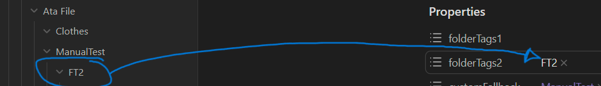

Autotag knows where the value belongs because `folderTags2` is configured as a Folder Property. In Automatic mode, the plugin discovers values already used by that property in the vault:

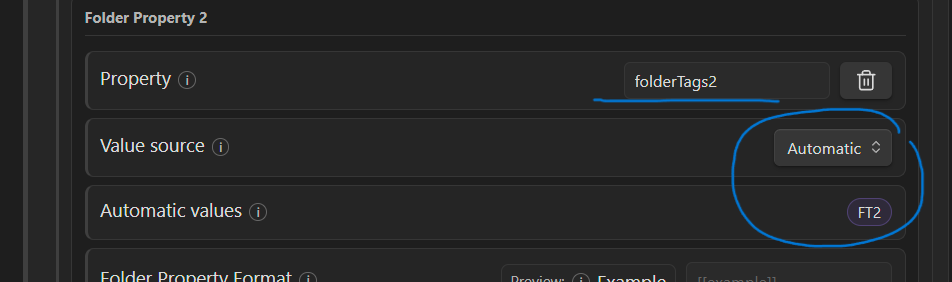

The discovered value remains available as an automatic option and is written to the matching property:

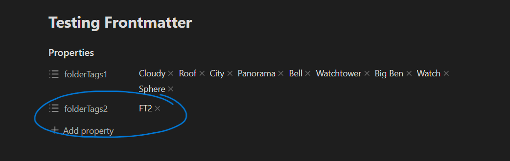

You can switch the value source to Manual and enter a comma-separated list instead.

### Folder Fallback

The folders `ManualTest` and `FTfallback` are not assigned to either Folder Property, so they are collected in `customFallback`:

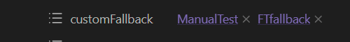

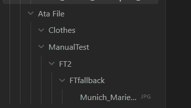

The fallback property can be renamed and its values can be reformatted. Disable Folder Fallback when unmatched folder names should be discarded instead of written:

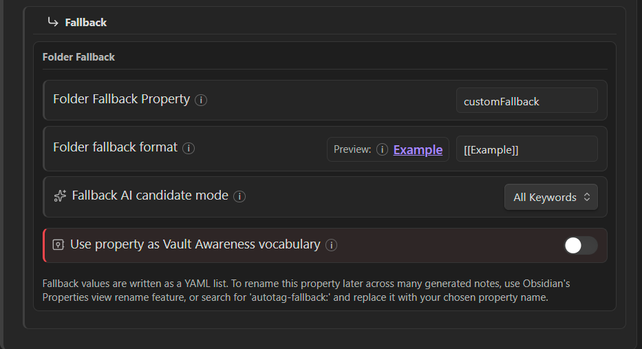

### Custom Template Text

You can write your own frontmatter values directly into the selected template. Autotag preserves unrelated template content while adding or updating its enabled output properties:

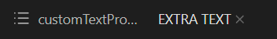

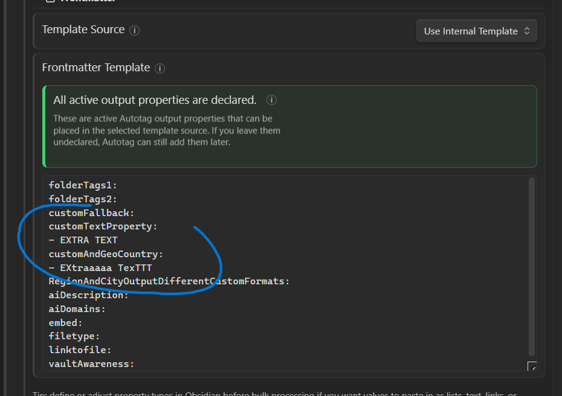

### Custom Text With Geolocation

A property can combine your custom template text with a geolocation result. Here, the custom text and the detected country share one property:

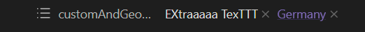

The country output is assigned to `customAndGeoCountry`:

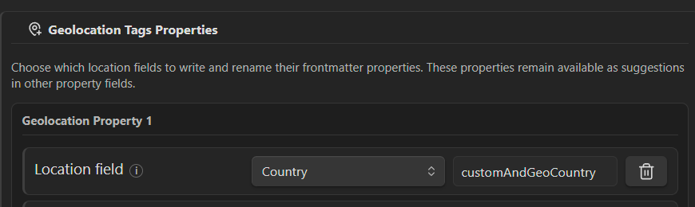

The custom value remains declared in the template:

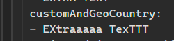

### Multiple Geolocation Formats

For a more involved example, two Geolocation Tags outputs share the same target property while using different formats:

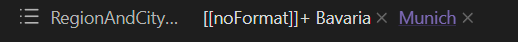

The region output uses `[[noFormat]]+ Example`, producing the literal text plus the official result, such as `[[noFormat]]+ Bavaria`. Brackets create a complete link only when the entire generated value is enclosed:

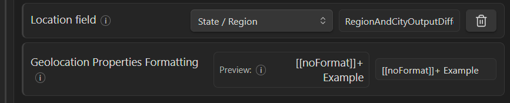

The city targets the same property with its own output format:

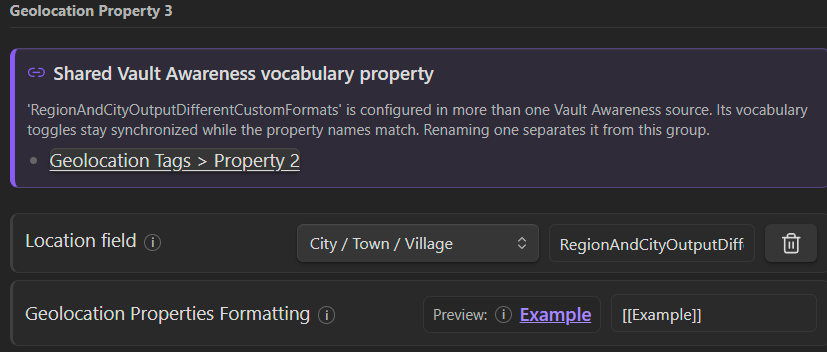

### AI Description

The Vision-Description model creates a descriptive property from the image:

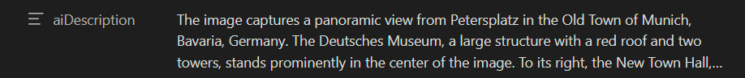

Download Ollama, select or enter a compatible vision model, and pull it directly from the settings. You can also customize the prompt and minimum description length:

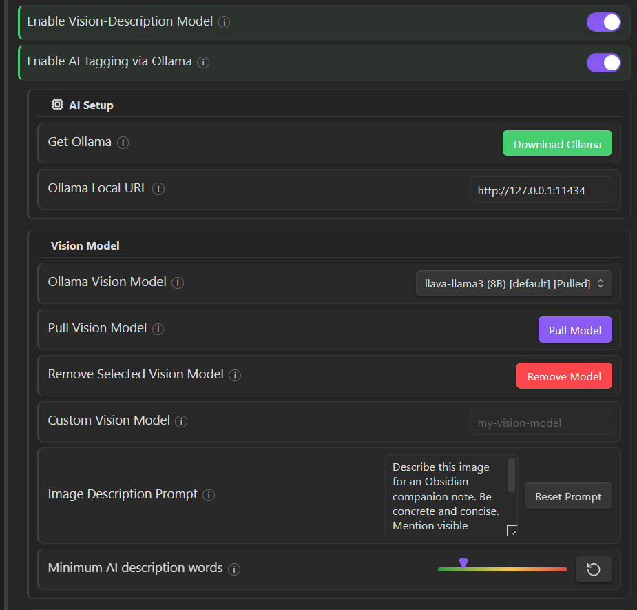

### AI Tags

AI Tags are generated from the description and any other enabled AI Input sources:

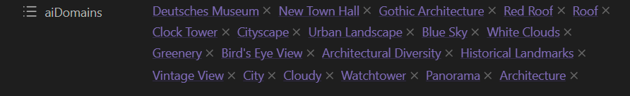

The Tag Model has the same pull and custom-model workflow as the Vision Model:

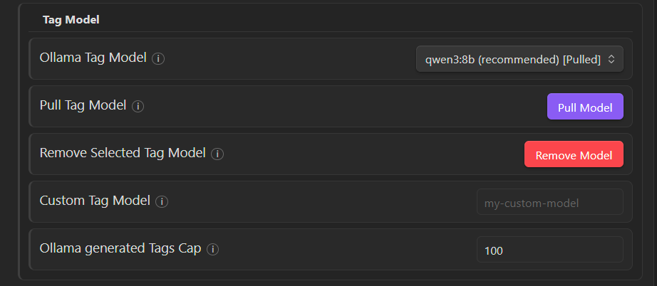

AI Input updates dynamically from settings elsewhere in the plugin, including filename, Folder Tags, geolocation, Vault Awareness, and Bridge sources:

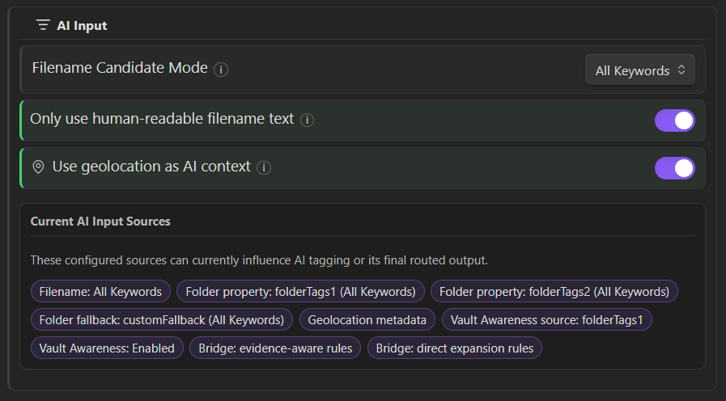

The output property, format, exclusions, and vocabulary behavior can be customized separately:

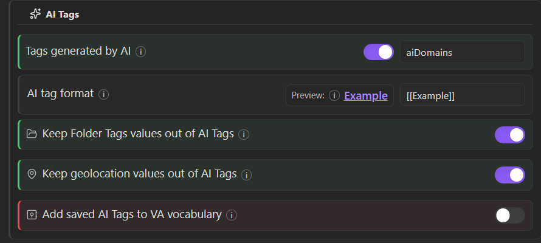

### Plugin Properties And Galleries

Autotag can also write the source embed, file type, and link back to the original file:

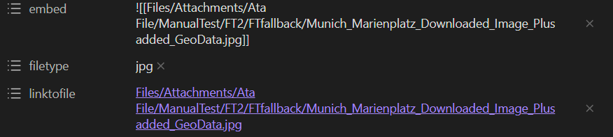

Each property can be independently enabled and renamed:

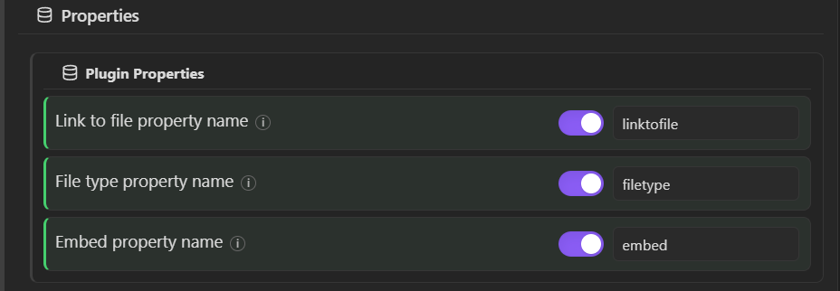

Using at least `linktofile` is recommended because it can provide a proper thumbnail source for an Obsidian Gallery view:

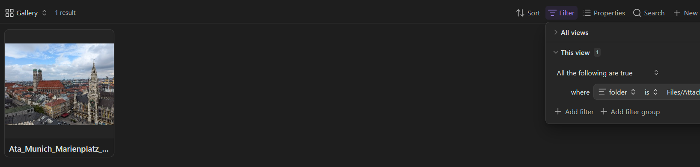

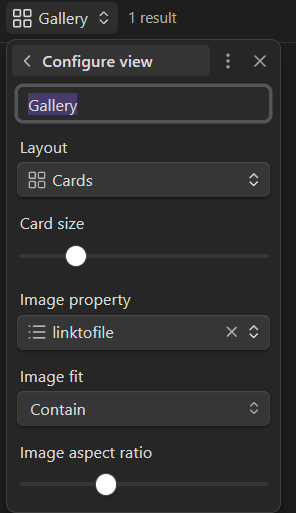

### Vault Awareness

Vault Awareness matches current-file evidence to vocabulary that already exists in configured vault properties:

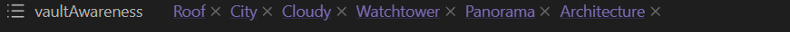

In this example, the vocabulary originates in `folderTags1`:

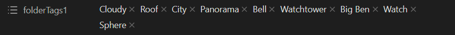

Enabling **Use property as Vault Awareness vocabulary** makes values stored in that property eligible across the vault:

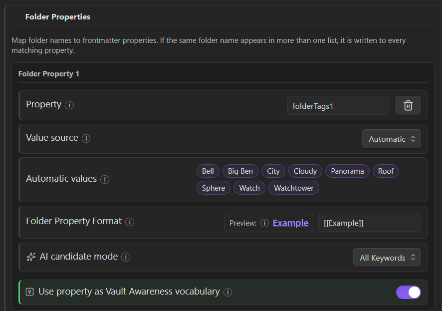

The property then appears in the active Vocabulary Sources list:

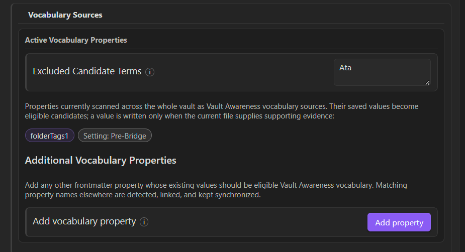

Adaptive Vault Matching can learn and review close relationships, including word-family relationships such as `Clouds -> Cloudy` and `Panoramic -> Panorama`:

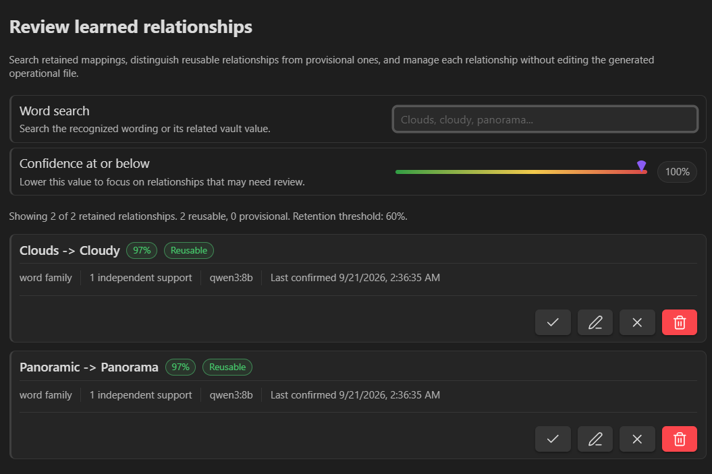

Depending on your output mode, the original AI wording can be preserved while the recognized vault wording is written to the Vault Awareness property:

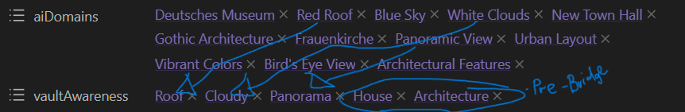

### Bridge Rules

The example also contains `Architecture`. This comes from the manual rule `House => Architecture` and the Pre-Bridge setting shown in the Vault Awareness sources.

When **Pre-Bridge terms for Vault Awareness output** is enabled, a fitting manual connection can contribute to Vault Awareness before the term has been written to frontmatter. Otherwise, Bridge rules act as explicit connections between concepts in the form `A => B`.

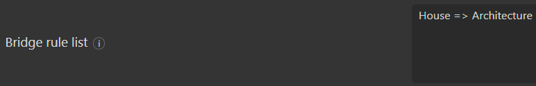

and here are the context menus

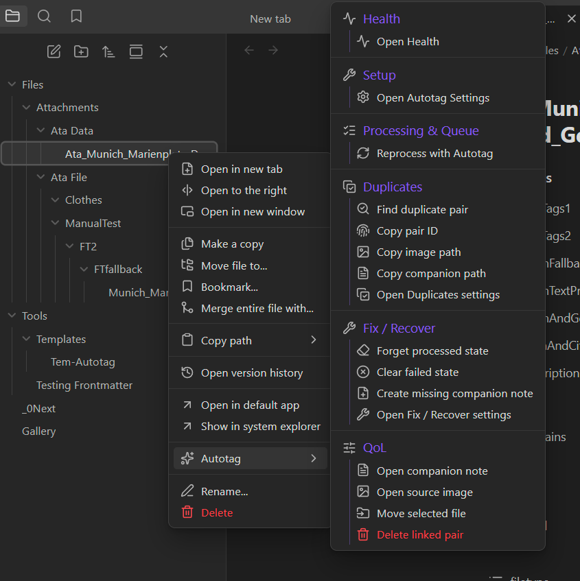

## Companion Note Name Tokens

Companion note names can use `{{name}}`, `{{filename}}`, `{{extension}}`, `{{path}}`, `{{link}}`, and `{{embed}}`.

Token casing changes only name-like tokens. Uppercase tokens such as `{{NAME}}` write uppercase, title-style tokens such as `{{Name}}` preserve the original upper/lowercase text, and lowercase tokens write lowercase. `{{path}}`, `{{link}}`, and `{{embed}}` always preserve the real vault path casing so links remain valid.

## Notice

- This plugin was vibe-coded, tested continuously, and adapted to fit its intended workflow.
- Tested with:
  - Obsidian `1.12.7`
  - Obsidian installer `1.8.10`
- The plugin was developed in English and may work with other languages that use a Roman/Latin alphabet.
  - You are welcome to port or improve support for other languages.
- Not yet fully tested:
  - Custom AI URLs
  - Private/local Nominatim installations
- Please report bugs with reproducible steps through [GitHub Issues](https://github.com/marumimamori/autotag/issues), or in the YouTube comments once the video is available.

## Independence And Thanks

Autotag is independent and does not require Binary File Manager, Templater, or AI Image Analyzer. Those community projects helped inspire the companion-note, templating, and image-to-metadata ideas behind the plugin.

## Beta Notes

Autotag is still in beta. BRAT is the recommended distribution path while the plugin is tested with real vaults before a wider Obsidian Community Plugin submission.

Public Nominatim is rate-limited and shared by the community. Autotag queues delayed geolocation lookups and can use a local Nominatim server when configured.

No telemetry is included.

## License

Autotag is free software licensed under **GPL-3.0-or-later**.

If you distribute a modified version, keep the license and attribution notices, provide the corresponding source code, and retain the original project attribution from `NOTICE`.

## Development

Install dependencies:

```bash
npm install
```

Build:

```bash
npm run build
```

For a manual test installation, copy `manifest.json`, `main.js`, and `styles.css` into:

```text
<Vault>/.obsidian/plugins/autotag/
```

Then reload Obsidian and enable **Autotag**.
